# Cyber Threat Intelligence

## Quick History

- In each conflict there are people watching, analyzing and reporting observations about adversaries, this is Threat Intelligence,
- Understanding how the adversaries operate, understand their tactics and sometimes their motivations can shape the outcome of the struggle.

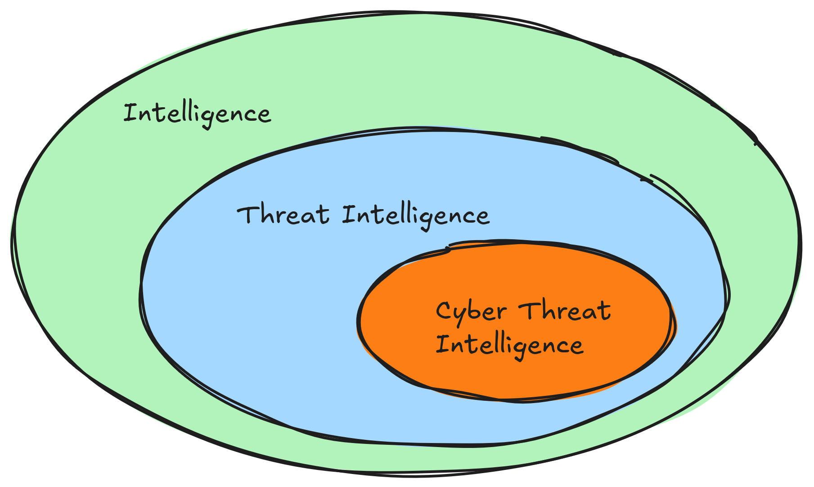{height=120pt}

# Intelligence

## Introduction

> It consists of gathering **facts**. … It consists of forming **hypotheses** on the basis of these facts, of testing these hypotheses for traces of one’s own ignorance or **bias**, of cleansing them if possible. The goal is to build better hypotheses than already exist and to establish them as relatively more true: it is to reveal a sharper picture of what happened and to make a closer approach to actuality than anyone has yet contrived.

Sherman Kent

## Data versus Intelligence

- Intelligence is derived from a process of collecting and analysing data,
- Indicator of Compromise like IP addresses, malware hashes, and domain names are only facts if they are shared without context: 
  - What is the source?
  - What is the confidence in the source, and the information?
  - What was the activities associated with this data points?
  - For how long this data is likely to stay relevant?
  - etc.
- Though sharing IoC has its value, to jointly produce CTI, or corroborate our own findings.

## Traditional Sources of Intelligence

- HUMINT: Human-source Intelligence -- covert ops, interviews
- SIGINT: Signal Intelligence -- interceptions, electronic devices
- OSINT: Open source Intelligence -- publicly available sources
- IMINT / GEOINT: Imagery and Geospatial Intelligence -- radar / location data
- MASINT: Measurements and signature Intelligence -- waves
- FININT: Financial Intelligence -- cryptocurrencies

# Cyber Threat Intelligence

> Acquiring, processing, analyzing, and disseminating information that identifies, tracks, and predicts threats, risks, and opportunities inside the cyber domain to offer courses of action that enhance decision making.[^1]

[^1]: CMU - Cyber Intelligence Tradecraft Report

## CTI-specific Sources of Intelligence{.allowframebreak}

### Free Threat Intelligence feeds 

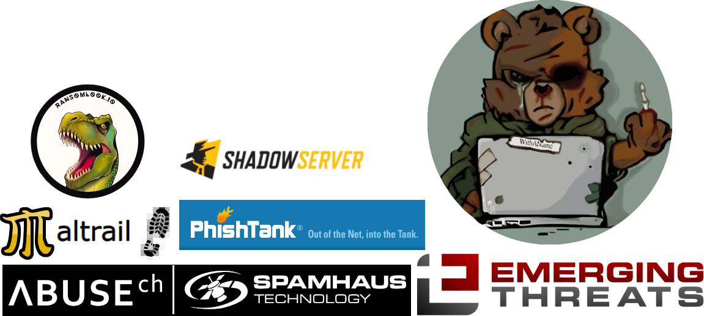{height=158pt}

---

### Free Threat Intelligence and Technical reports

- ANSSI/CERT-FR, CERT EU, 
- CIRCL technical reports,
- [https://github.com/Bert-JanP/Open-Source-Threat-Intel-Feeds](https://github.com/Bert-JanP/Open-Source-Threat-Intel-Feeds)

### Commercial Threat Intelligence feeds
- Feeds on CTI reports,
- YARA rules in VT to grab relevant information
- Shodan / Censys / FOFA alerts on public facing applications

---

### In house telemetry (security and other)

- DNS requests (and responses) is a treasure trove
  - Build a in-house passiveDNS database
- Alerts or summary of alerts
  - SIEM alerts / logs
  - Spam filters logs
  - Know more about what actually hits the organisation

---

### Past incidents

- CTI and Incident Reponse are mutually beneficial.
- Analysis of intrusions (successful or not) provides information about:
  - initial access vector,
  - persistence tactics,
  - evasion tactics,
  - lateral movement tactics,
  - final action and goal,

  \
  **&rarr;** better filtering rules,\
  **&rarr;** insights in adversaries motivations, goals, and targetted sectors and industries.\
  **&rarr;** better overall security guidance,\

---

### Past data breaches / data leaks
- Create means to retrieve data leaks and random files securely (VPS seedbox, machine blanche, remote exit nodes)
- This data can be reused by attackers
  - Spear phishing hits different.
- Uncover trust relationships to tools and other orgs.

---

### Forums, chatrooms, and paste sites

- Get data about current actors and TTPs,
- Get notified of available data leaks
- Get into adversaries communication loops.

\vspace{20pt}

{height=90pt}

---

### App Stores, web extensions

- Impersonation,
- Typosquatting.
- for instance [https://github.com/ail-project/ail-feeder-apk](https://github.com/ail-project/ail-feeder-apk)

---

### Passive DNS

- DNS requests / responses over time

### Malware Source

- MWDB
- Vx-underground

### TLS certificate
- Certificate Transparency logs

### Software library repositories

- Keep an eye on your software supply chain,
- Their could be typosquatting and other shenanigans.

---

### Honeypots / honeynets

- Create tripwire to see adversaries in your perimeters,
- Get data about Threat Actors and TTPs,
- Get data about currently exploited vulneratilibies. 

### New vulnerabilities

- Get data about new vulneratbiliies, proof of concepts, and exploits,
- Get data about currently exploited vulneratilibies. 

### CTI from ISACs and information sharing communities (MISP <3)

- Get Intelligence from partners, from related sectors and industries,
- Get sightings.

---

### Offer publicly available services 
- **if a service is free, you are the product**
  - when your organisation uses a freemium product, it provide data to a third-party,
  - for instance a file scanned on VirusTotal will be spread as part of VirusTotal data stream. 
- **nothing stops you to do the same**
  - provide a free service to the community,
  - be very clear about the model.

### Offer services to your constituencies
- **same model applies to your constituencies**
  - Provide the means for scanning files, investigate phishing, etc.
  - So this data does not leave your organisation and benefits your CTI program.

---

## Types of Threat Intelligence

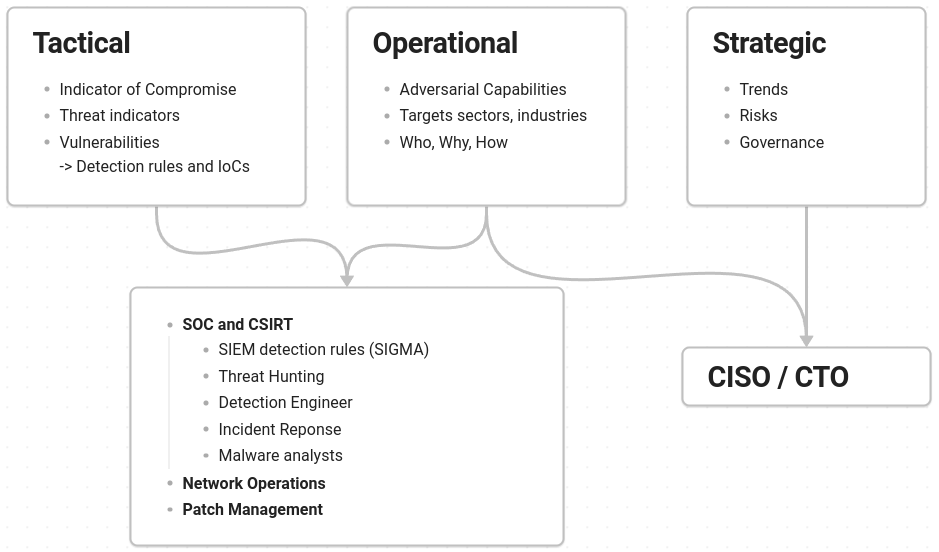{height=190pt}

## Intelligence Life Cycle{.allowframebreak}

{height=220pt}

---

A framework for transforming raw into actionable intelligence:

1. **Planning and Direction**  
   - **Setting Objectives:** Define what intelligence is needed and why.  
   - **Tasking:** Determine the sources and methods to collect the required data.

2. **Collection**  
   - **Data Gathering:** Systematically search for and collect relevant data.
   - **Source Identification:** Utilize both public and commercial data sources while respecting legal and ethical boundaries.

3. **Processing and Exploitation**  
   - **Data Cleaning:** Organise, filter, and structure raw data into a manageable format.  
   - **Initial Analysis:** Begin the process of validating sources and identifying key pieces of information.

---

4. **Analysis and Production**  
   - **In-Depth Analysis:** Contextualise and interpret the processed data to form an intelligence product.
   - **Synthesis:** Combine multiple sources and data points to derive comprehensive insights.
   - **Intelligence Product:** Produce reports or briefs that address the initial intelligence requirements.

5. **Dissemination**  
   - **Distribution:** Share the intelligence product with the designated audience, ensuring that it reaches those who can act upon it.
   - **Feedback:** Gather feedback to refine the intelligence cycle, ensuring continuous improvement in future cycles.

6. **Evaluation**  
   - **Assessing Impact:** Review the effectiveness of the intelligence product.
   - **Lessons Learned:** Identify successes and shortcomings to improve subsequent intelligence operations.

---

### Direction

#### We look into our organisation's assets:

- The organisation's assets that need to be protected
  - a software shop would focus on its source code
  - a bank could focus on its Point of Sales systems
  - a saas on the availability of its services through the network
- The potential impact of losing these assets
- The type of Threat Intel required to protect these assets

#### We define priorities about what to focus on:

- Who are our stakeholders
- We set boundaries and expectations
- We develop Priority Intelligence Requirements (PIR)

---

#### How to define assets?

- Crown-Jewel Analysis (Risk Analysis):
  - Indentify critical assets to protect,
    - Inventory, asset management.
  - Assess the value of those assets,
    - Operational impact: how it affects business operation
    - Financial impact
    - Regulatory compliance requirements
    - Reputational damage if compromised
  - Perform a threat modeling and risk assessment to find ways to protect these.
    - Asset, Threat, Vulnerability
    - Security controls

---

#### How to define stakeholders?

\

{height=150pt}

---

#### How to define PIR?

{height=160pt}

---

#### How to define PIR?

![US Marine Corps Urban Generic Information Requirements Handbook[^2]](img/marinecorpsugirh-list.png){height=160pt}

[^2]: https://irp.fas.org/doddir/usmc/ugirh.pdf

---

#### How to define PIR?

- Perform focus groups / interviews with stakeholders[^3]:
  - They understand the their assets and the operations (business)
  - As a security practitioner you don't know what you don't know
  - Build relationship, manage expectations.

---

#### How to define PIR?

- Understand their needs:
  - Get contact details
  - What is their concern related to cyber security that could affect their team's operations?
  - What are the most critical assets that their team needs to have protected?
  - What information do they need to maintain their security posture?
  - What type of Threat Intelligence would be the most valuable?
  - How would they ideally receive intelligence?
    - Report?  Frequency?
    - ad-hoc Request For Information?
    - instant message?

[^3]: https://www.first.org/resources/papers/firstcti24/Josh-Darby-MacLellan-How-to-Start-Using-Priority.pdf

---

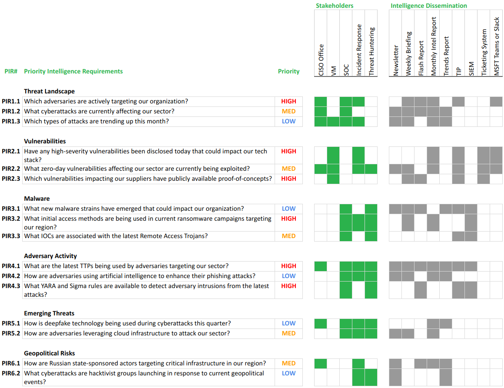{height=200pt}

---

#### Request For Information

- The request: what question is being asked
- The requestor: who ask this question
- The output: what answer is actually needed? IoC? briefing? report?
- References: what initiated the question
- Due Date, priority: deadline.

---

#### Planning updates

- Review your CTI plan regularly to update stakeholders' needs
- Remove Intelligence requirements that are no longer useful
- Implement feedback to improve the provided Intelligence.

\ 

![Intel 471 example[^4]](img/pir-review.png){height=50pt}

[^4]: https://intel471.com/resources/cyber-underground-handbook

---

#### Keeping track of the process

\vspace{10pt}

- Keeping track of the process and different tasks is challenging,

\vspace{10pt}

- flowintel[^5] is an OSS case management tool that can help:
  - Create templates for each type of tasks (collection, analysis, reporting, etc.), 
  - Can be used outside of the CTI realm for incident response,
  - Use playbooks to follow a given methodology
  - Streamline interaction with other OSS tools (e.g. MISP)

\vspace{10pt}
  
[^5]: flowintel[https://github.com/flowintel/flowtinel](https://github.com/flowintel/flowtinel)

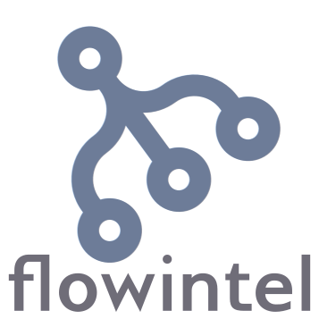{height=50pt}

---

### Data Collection

Once we defined PIR, we need to align these with **Data Collection** efforts.

\ 

{height=140pt}

---

### Collection Management Framework

- The team need to understand what is the data aligned to each Intelligence Requirement
  - How this data is produced,
  - By whom, 
  - What is available in this data,
  - What are the limitations of this data,
  - What question is can help answering.

\vspace{10pt}
  
{height=60pt}

---

#### Vulnerability monitoring

- My organisation uses a Cicso product called "Acceleration Wide Area Application Services (WAAS)", is there any recent vulnerabilities that I should be aware of?
- Try to find the information on the Internet.

---

\vspace{10pt}

- OSS Vulnerability feed: vulnerability-lookup[^6]
  - Receive free vulnerability feeds (RSS) and notifications,
  - Create bundles, comments and intelligence,
  - Gathering sightings from vulnerabilites,
  - Producing threat intelligence report.

\vspace{10pt}

[^6]: [https://vulnerability.circl.lu/](https://vulnerability.circl.lu/)

{height=50pt}

---

#### RSS intermede -- curtosy of Mr. Dulaunoy.

- RSS 0.90 (Really Simple Syndication) was originally released on March 15, 1999, by Netscape.
- It evolved into a simpler format with RSS 0.91, where the RDF elements were removed, developed by Dave Winer.
- RSS 1.0 was later developed by the RSS-DEV Working Group, followed by the release of RSS 2.0.
- The IETF later published the Atom Syndication Format (RFC 4287), a more consistent format[^7] , yet it remains closely related to the RSS format.

[^7]: It’s worth noting that RSS 1.0 also normalized the use of RDF, enabling compatibility with Activity Streams and other data-sharing standards.

---

##### Format and Concept

- Atom and RSS are XML-based documents used to describe feeds, which consist of lists of related information.
- Each feed comprises a list of items or entries, each described with metadata such as title, publication date, and link.
- These formats are commonly used for updates of web content and audio content, like podcasts.
- However, the concept also extends to information security, where lists of updated items are crucial for tracking security events, updating threat intelligence feeds, and tracking log files.
- RSS / Atom is a key technology **Data collection** and **Automation**.

---

##### Use

- Broad support in blogs, news sites, Mastodon[^8], etc.
- Broad support for RSS in mail clients, Security orchestration, automation and response (SOAR) tools.
- Dedicated clients,
- [https://github.com/SK-CERT/Taranis-NG](https://github.com/SK-CERT/Taranis-NG)
- [https://taranis.ai/](https://taranis.ai/)
- [https://github.com/adulau/rss-tools](https://github.com/adulau/rss-tools)

[^8]: Simply take any Mastodon handle and append .rss to it.

---

#### OSINT

- In the **US context**, OSINT is understood as an **intelligence product**:
  - Information is collected, processed, and transformed into actionable intelligence.
  - The end product is tailored for a specific intelligence requirement and disseminated to the appropriate audience.
- In the **EU context**, OSINT is more commonly seen as a **process**:
  - It involves the systematic collection and analysis of data from publicly available sources.
  - The emphasis is on transforming raw data into actionable intelligence through validation and rigorous analysis.

---

- **Open Source INFormation (OSINF)**
  - Refers to the raw, unprocessed data available publicly.
  - Presenting OSINF without further validation, analysis, or contextualisation does not meet the standard for OSINT.

- **Open Source INVestigation (OSINV)**
  - Involves investigative practices using open sources; notable examples include investigative teams like Bellingcat.

---

- **Legality and Boundaries**
  - OSINF is obtained legally and diverges from covert or clandestine intelligence methods.
  - OSINT practices do **not** involve unauthorized access to data; they focus solely on information that is already publicly available—even if the data originated from a grey area regarding its release.

- **Types of Sources**
  - **Public Sources:** Information accessible to everyone, although accessibility can sometimes be limited by factors such as location or language.
  - **Commercial Sources:** Data that might be available through paid services, such as openRTB (for advertisements), device-graph datasets, MAID data, or geolocation data.

- **Intelligence Requirements**
  - Both the US and EU models stress the need for a clearly defined intelligence requirement that drives the collection and analysis of OSINT.

---

##### Ethics and the JAPAN Principle in OSINT

- **Justification:**  Every OSINT activity should have a clear, legitimate objective that justifies the collection and use of information.
  
- **Accountability:** Investigators must be accountable for their methods, ensuring that all procedures are documented and can be scrutinised if necessary.

- **Proportionality:** The methods and scope of data collection should be proportionate to the intelligence requirements. 

- **Autonomy:** OSINT should be conducted in a way that maintains the independence and objectivity of the analysis. Avoid blending open source collection with clandestine methods that could lead to ethical or legal breaches.

- **Non-Maleficence:** -- **Do No Harm:** Ensure that the collection, analysis, and dissemination of information do not cause unnecessary harm to individuals or groups. 

---

##### Potential OSINT pitfalls

- Was the source translated from foreign languages, by whom? What is their ability? Do they understand Slang?
- Who wrote / published the material? What organisation?
- What is the author/s history based on previous reports?
- Are they multiple point of view in this report?
- What's the author's point of view?
- What's the author's baskground and motivation? Are they any identifiable biases?

---

#### Data leak and Brand Monitoring

\vspace{10pt}

- OSS tool for leak detection and social network monitoring: AIL [^9]
- AIL framework allows to collect, crawl, dig and analyse unstructured data.
- spot **information leaks**
- crawling services for **Tor** 
- specific feeders (Telegram, discord, fediverse, github, paste sites, etc.)
- You will receive a comprehensive AIL training in the following weeks.

\vspace{10pt}

{height=50pt}

[^9]: [https://ail-project.org](https://ail-project.org)

---

#### Forums

\vspace{10pt}

- OSS tools for grabing forum's content: Lookyloo and Lacus [^10]
- Lacus is a web page capturing system that use microsoft' playwright
- Lookyloo [https://lookyloo.circl.lu](https://lookyloo.circl.lu) uses Lacus to grab webpages
  - Dig into urls of alledged phishing,
  - Check redirects, content loaded,
  - Correlate with previous cases,
  - Can configure the capture (location, proxy)
  - Can perform `headfull` captures.

\vspace{10pt}

{height=50pt}

[^10]: [https://github.com/ail-project/lacus](https://github.com/ail-project/lacus)

---

#### Certificate Transparency logs

\vspace{10pt}

- OSS tools to get Certificate transparency logs:  Cocktailparty[^11]
- Cocktailparty can grab, filter and stream CT logs
  - CT logs is a big dataset
  - Cocktailparty allows for filtering the output before sending the data.
  - Public instance ar [https://cocktailparty.lu](https://cocktailparty.lu)

\vspace{10pt}

{height=50pt}

[^11]: [https://github.com/flowintel/cocktailparty](https://github.com/flowintel/cocktailparty)

---

#### Pandora

  - OSS Analysis tool: pandora[^12]
    - Check document via a web interface or email,
    - Quickly eliminate false positive,
    - Prevent data leak to third parties,
    - End-user friendly.

\vspace{10pt}
  
[^12]: [pandora](https://github.com/pandora-analysis/pandora)

{height=50pt}

---

#### MISP 

  - OSS Information Sharing Tool: MISP[^13]
    - Receive free CTI feeds,
    - Store data about incidents and add context,
    - Correlation, data enrichement,
    - Analysis tools (graphs, timelines, reports, etc.)
    - Kickstart collaboration with partners, build trust.

\vspace{10pt}

[^13]: [MISP](https://misp-project.org)

{height=50pt}

---

#### IntelMQ

  - OSS CTI feeds collection: IntelMQ[^14]
    - Automate the collection of data from a lot of sources (e.g. Botnet logs, C2, brute-force attempts, etc. ) 

\vspace{10pt}

[^14]: [https://intelmq.readthedocs.io/en/develop/](https://intelmq.readthedocs.io/en/develop/)

{height=50pt}

---

#### Typosquatting

- OSS tool for detecting typosquatting: typosquatting-finder[^15]
  - generate, find and assess existing **fake domain used by adversaries**
  - **standalone Python library**[^16] for integration with other tools.
  - Support many (20+) domain generation algorithms, automatic MISP integration and false-positive detections.

[^15]: [tf](https://typosquatting-finder.circl.lu/)
[^16]: [library](https://github.com/ail-project/ail-typo-squatting)

{height=50pt}

---

#### Data filtering

- Filtering rules in AIL:
  - Genarated from typosquatting-finder,
  - Generated by other means (mammouth example)
- Filters in security are everywhere
  - regex
  - yara rules
  - suricata datasets
  - poppy / flor / fleur / araygrass

---

#### Creativity

- You may sometimes wonder how you could get hold of some data to meet an Intelligence Requirements,
- be creative but by all means, respect law and your organisation's ethical guideline.
- (example ;)

---

#### Evaluation of Source Reliability: Admirality Scale

- Assess **Source Reliability** and **Information Credibility** separately
- A1 -> F6

\vspace{10pt}

{}

---

**You receive a report from a top-tier cybersecurity firm:**

\vspace{5pt}

- The source has consistently provided accurate and timely information in the past.

\vspace{5pt}

**How would you rate this source?**

\vspace{5pt}

- Their report claim that a new 0day vulnerability in widely used software is being actively exploited.
- This claim is backed up by multiple independent and trusted sources.

\vspace{5pt}

**How would you rate the information?**

---

**You receive a notification about a patch for a vulnerability that affects one of your assets.**

\vspace{5pt}

- The source has consistently failed to provide patches that actually work.

\vspace{5pt}

**How would you rate this source?**

\vspace{5pt}

- Their security advisory claims that the patch resolves the issue.
- No further explanation is provided.

\vspace{5pt}

**How would you rate the information?**

---

**You receive a notification from ShadowServer that your organisation exposes a vulnerable application: `erlang Open Telecom Platform -- SSH server`.**

\vspace{5pt}

- The source has consistently provided accurate and timely information in the past.

\vspace{5pt}

**How would you rate this source?**

\vspace{5pt}

- You have no knowledge of this application being used in your organisation.

\vspace{5pt}

**How would you rate the information?**

---

##### in MISP

\vspace{10pt}

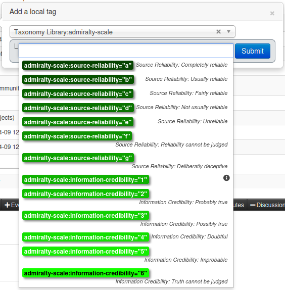{height=180pt}

---

#### Pivoting

- You've seen a lot of this in the MISP training,
- You will see more in the AIL training,
- It boils down to:
- Domain -> whois:
  - CIDR / IP -> passive DNS
    - more IPs -> MISP correlations
  - Pivot on Certificate
  - Pivot on Certificate provider
  - Pivot on JARM
  - Pivot in hosting / hosting provider / server type

---

### Processing and Exploitation

- Data comes in many form, some follow a defined model, some is unstructured:
 - Raw pcap
 - Netflow
 - Raw log - Needs grokking
 - OSINT data requires some carving in order to make sense of it.
- Here is a possible flow:
  - Normalize
  - Enrich
  - Structure and deduplicate
  - Entity recognition
  - Combine and link
  - Model

---

#### Create Playbooks and automate where possible

- Normalization playbooks
  - Scripts and tooling to facilitate IoC extraction from `pdf` files, `doc` documents, and media files.
  - data normalization / Extract Transform and Load tools
  - Automatic tagging (see MWDB / Karton)
  - Use sandboxing services  to understand a binary's behaviour
    - JoeSandbox, Anyrun
    - Kunai sandbox
    - CAPE sandbox
    - Cuckoo
    - Basic snapshop diffing with QEMU can also do the work ;)
- Use common framework, tools, and taxonomies
- Correlate automatically indicators against activity in the SIEM, and know indicators,
- Filter out irrelevant information

---

#### Normalizing

- In some cases, you just need to transform from one format to another
- Extract Transform and Load tools
  - Apache NIFI
  - Redpanda Bento / Benthos
  - Elixir Flow / Broadway
- Tenzir
- SIEM - Wazuh
- ELK / logstash

---

#### Enriching

- Use MISP module within MISP, or standalone
- In the ETL pipeline, we can normalize and enrich the data: 
  - Apache NIFI:

{height=150pt}

---

- In the ETL pipeline, we can normalize and enrich the data: 
  - Benthos

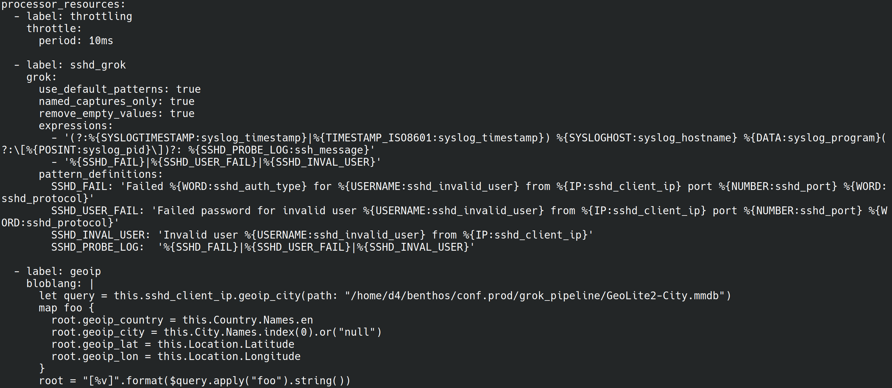{height=180pt}

---

{height=180pt}

---

#### Entity recognition

- Data should already be filtered to fit your needs but you still need to recognize other entities:
  - By hand,
  - By using filters,
  - By using Natural Language Processing techniques:
    - Named Entity Recognition with BERT
    - see for instance [https://cti.tools](https://cti.tools) [https://github.com/ctitools/](https://github.com/ctitools/)
  
---

### Modelling

- Cyber Kill Chain
- Diamond model
- MITRE ATT&CK

- The goal is to be able to find patterns and commonalities
  - Correlating clusters.

---

####  Cyber Kill Chain

- Reconnaissance: Intruder selects target, researches it, and attempts to identify vulnerabilities in the target network.
- Weaponization: Intruder creates remote access malware weapon, such as a virus or worm, tailored to one or more vulnerabilities.
-Delivery: Intruder transmits weapon to target (e.g., via e-mail attachments, websites or USB drives)
- Exploitation: Malware weapon's program code triggers, which takes action on target network to exploit vulnerability.
- Installation: Malware weapon installs an access point (e.g., "backdoor") usable by the intruder.
- Command and Control: Malware enables intruder to have "hands on the keyboard" persistent access to the target network.
- Actions on Objective: Intruder takes action to achieve their goals, such as data exfiltration, data destruction, or encryption for ransom.

-> map to possible defences

---

#### Diamond Model [^17]

- Four main components:
  - Adversary (nation state, hacktivists, cybercriminals, ransomware gangs)
  - Infrastructure: The technical resources or assets the adversary uses during the attack. (C2, watering holes, tor hidden services, servers.)
  - Capability: A method, tool, or technique the adversary uses during the attack (e.g., malware, tools, exploits).
  - Victim (sector, industry, governements, corporations, individuals)

[^17]: [https://apps.dtic.mil/sti/citations/ADA586960](https://apps.dtic.mil/sti/citations/ADA586960)

---

{height=200pt}

---

#### Diamond Model

- Relationships:
  - Adversary-victim: This relationship concerns questions such as why the attacker selected this target and the attacker’s motivations and objectives.
  - Adversary infrastructure: This relationship concerns how the attacker establishes and maintains its cyber operations.
  - Victim-infrastructure: This relationship concerns the attacker’s use of various channels, methods, and vectors against the target.
  - Victim-capability: This relationship concerns specific tactics and attack signatures used against the target.

- Attributes:
  - Adversary's name, motivation, TTP, attribution indicators,
  - Infrastructure's location, communication protocols, domain registration, server hosting.

---

#### Diamond Model - pivoting

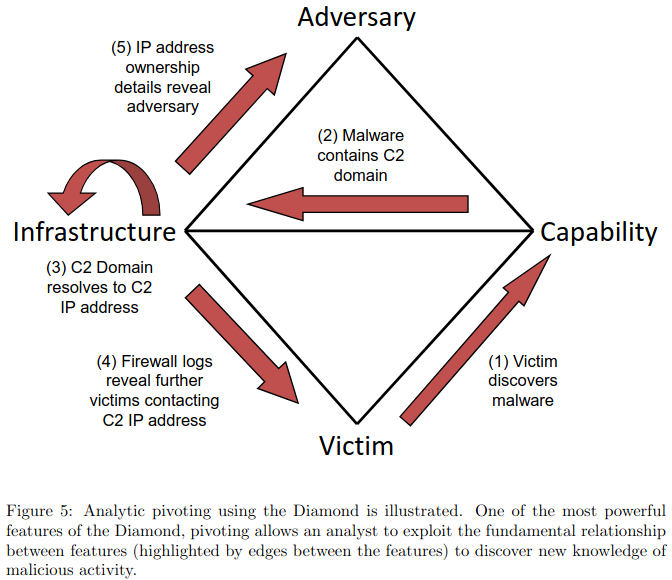{height=200pt}

---

#### Diamond Model - events

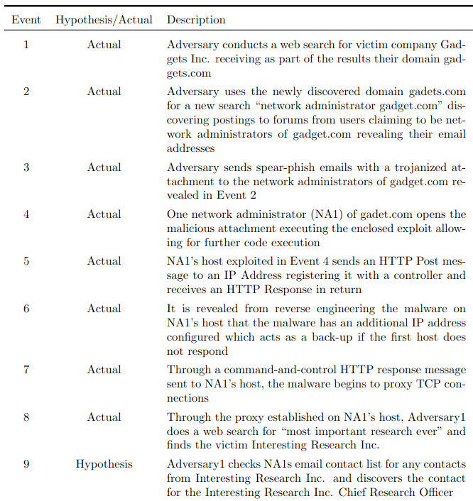{height=200pt}

---

#### Diamond Model

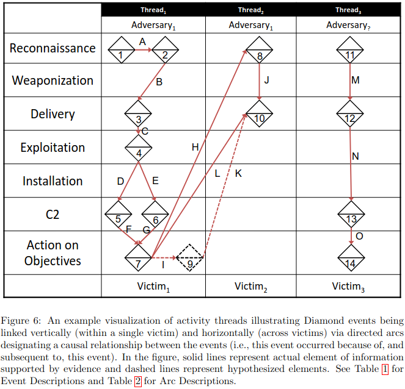{height=200pt}

---

####  MITRE ATT&CK

- A framework to document tactices and techniques observed in the real world

{height=200pt}

---

### Analysis and Production

- Create Threat analysis playbook
  - Defined, documented, and repeatable analysis process
  - Use flowintel, a SOAR, or a bunch of python scripts to manage the process 

- Generate Findings
- Document the rationale
- Give supporting evidence.

---

#### Correlate Clusters

- Pivot on tags / context added in MISP
  - Build graphs
  - Build timeline
  - Complete the report, document your progress.
- Use the Diamond Model and the `rule of 2`
  - Look for overlap between two vertices in intrusions or campaings
  - Identify unique characteritics, and map these to the diamond model.

---

#### Attritbution

- Tactical Attribution: Clusters of related indicators: IP addresses, domains. No specific naming
- Operational Attribution: Extrapolation of characteristics from activity clusters (capaiblities, behaviors, and motivations).
- Strategical Attribution: Identify threat group / actor. Uncovering names, association, sponsors or ultimate beneficiary of the threat operations.

---

#### Use the rule on 2 with the diamond model

\vspace{10pt}

{height=100pt}

---

#### There is a catch 

- Analyst (people) have biases.
  - Confirmation biases: selectively supporting one H0
  - Jump to conclusion,
  - Frequency biases, etc.
  - A diverse team help getting cognitive diversity and mitigate biases somehow,
  - Strutured Analysis Techniques help mitigating the issue even individually.

---

#### Structured Analysis Techniques

Create an auditable and reproducible process to produce insights and findings from raw facts. Akin to "Thinking on paper, in public."

1. Issue identification.
2. Evidence Diagnostic: Ensure evidences are systematically reviewed
3. Hypothesis generation: Creatively determining reasonable options and alternatives
4. Structured Analysis Techniques: Systematically reviewing hypotheses or options to gain insights. 

- Brainstorming,
- Devil' advocate,
- Analysis of Competing Hypotheses

---

#### Analysis of Competing Hypotheses

The Process:

- Hypothesis: Identify hypotheses.
- Evidence: Collect evidence that supports those hypotheses. 
- Comparison: Create a matrix to compare the evidence to determine the most plausible hypothesis.
- Refinement: Refine the matrix by removing invalid evidence or hypotheses
- Prioritization: Prioritize hypotheses based on their relative likelihood.
- Dependencies: Determine which hypotheses are most sensitive to evidence being wrong. 
- Report: Report your most likely hypotheses to decision-makers and why you came to this conclusion. This will allow them to assess the best course of action.

---

Say you discover an indicator in your network logs categorized as “suspicious” by cyber threat intelligence (CTI) sources[^18]:

\vspace{10pt}

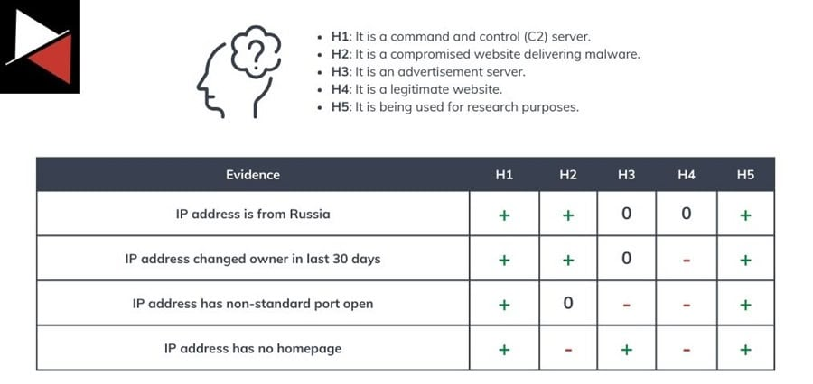{height=150pt}

[^18]: [https://kravensecurity.com/analysis-of-competing-hypotheses/](https://kravensecurity.com/analysis-of-competing-hypotheses/)

---

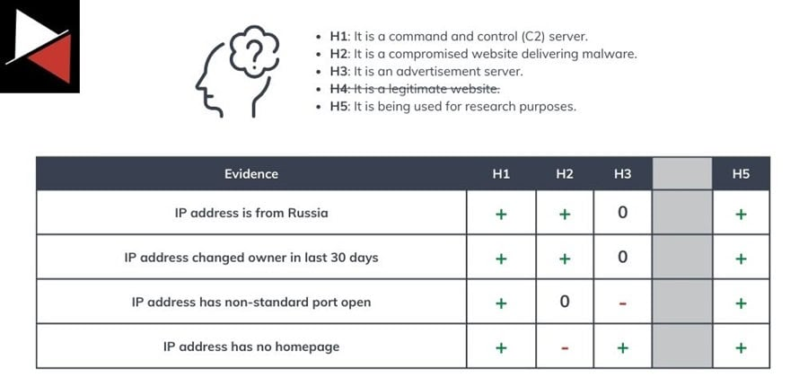{height=150pt}

---

#### Biases induced by the use of LLM

- Be super wary about the use of LLM[^19]
- Using LLM introduce additional analysis biases[^20]:
  - Interrogate AI answers,
  - Dissect summaries,
  - Validata narratives,
  - Force yourself to slow down and ponder the bot's answers
    - Switch models, use them concurrently

\vspace{10pt}

{height=80pt}

[^19]: [https://arxiv.org/pdf/2503.23175](https://arxiv.org/pdf/2503.23175)
[^20]: [https://www.dutchosintguy.com/post/the-slow-collapse-of-critical-thinking-in-osint-due-to-ai](https://www.dutchosintguy.com/post/the-slow-collapse-of-critical-thinking-in-osint-due-to-ai)

---

### Dissemination and Reporting

#### Know your audience

- The form of your report will change depending on your audience
  - Different audiences have difference intelligence needs (as agreed in direction phase)
    - Strategic / Operational / Tactical
  - Different audiences require data in different formats
    - reports,
    - executive summaries

---

#### Report conclusions

- Bottom line up front, or BLUF: Always start the report with your leading hypothesis. It is what the person reading your report is most interested in.
- Estimative language: Qualify your leading hypothesis with estimative language that describes your confidence in your assessment based on the number of possibilities assessed and evidence supporting it.
- Key evidence: Support your assessment with the key pieces of evidence that led to your conclusions. 
- Hypotheses considered: Finally, briefly describe the other hypotheses you considered and your reasoning for not prioritizing them. This will help the reader understand the rationale supporting your conclusions.

---

##### Assess Confidence and estimative language

- High confidence:
  - No evidence against
  - All but certian
- Moderate confidence:
  - Evidence missing
  - New evidence could invalidate the hypothesis
- Low confident:
  - Other likely hypotheses
  - Little evidence
  - Low trust in the sources

---

\vspace{10pt}

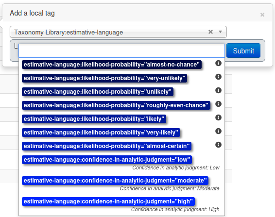{height=150pt}

---

#### CTI and Incident Response, why would you share with the world?

- Dissemination of CTI products brings:
  - observation the emergence of patterns,
  - sectorial / industries coordinated response (e.g. Solarwinds),
  - identifying vulnerable applications, and their versions,
  - Internet wide-scanning (e.g. Shadowserver),
  - put more pressure on vendors to produce a functional patch,
  - incident response from early indication of network breach,
  - shared defensive counter-measures,
  - better understanding of the risks.

---

#### Applying Classification

##### Traffic Light Protocol

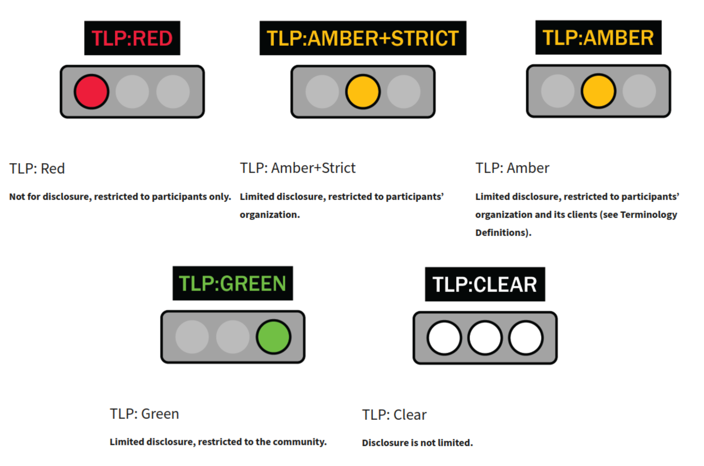{height=150pt}

---

{height=150pt}

---

##### Permissible Actions Protocol

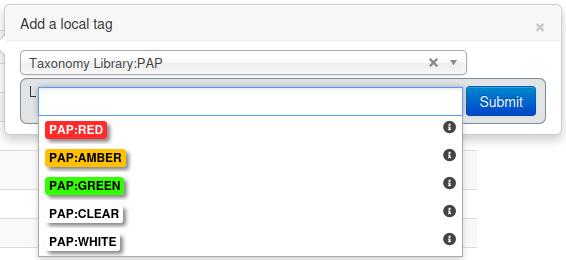{height=100pt}

---

### Feedback

- Assess the impact of your CTI program with your consistituency / stakeholders
- Define KPI to quantify its impact.

{height=200pt}

---

# Case study

- Look into NotPetya:
  - Find some sources on the Internet,
  - Who is the adversary?
  - Who were the victim / target?
  - What was the infrastructure?
  - Whast was the adversary's capabilities?

- Encode what you find in a MISP event,
  - Add technical indicators,
  - Build a timeline,
  - Build a graph,
  - Write a report,
  - Back up your findings with evidences.

## Resources{.allowframebreak}

- MISP [https://www.misp-project.org](https://www.misp-project.org)
- flowintel [https://github.com/flowintel/flowtinel](https://github.com/flowintel/flowtinel)
- lookyloo [https://github.com/Lookyloo/lookyloo](https://github.com/Lookyloo/lookyloo)
- CIRCL lookyloo [https://lookyloo.circl.lu/](https://lookyloo.circl.lu/)
- pandora [https://github.com/pandora-analysis/pandora](https://github.com/pandora-analysis/pandora)

---

- CIRCL pandora [https://pandora.circl.lu](https://pandora.circl.lu)
- Vulnerability Lookup [vulnerability-lookup](https://vulnerability.circl.lu/)
- typosquatting finder [https://typosquatting-finder.circl.lu/](https://typosquatting-finder.circl.lu/)
- [typosquatting finder library](https://github.com/ail-project/ail-typo-squatting)
- AIL [https://ail-project.org](https://ail-project.org)
- [Reuser & Arno on OSINT](https://rieas.gr/images/jmbi/ReuserArno.pdf)
- [Katie Nickels self-study plan](https://medium.com/katies-five-cents/a-cyber-threat-intelligence-self-study-plan-part-1-968b5a8daf9a)
- [Cyber Kill Chain](https://www.lockheedmartin.com/en-us/capabilities/cyber/cyber-kill-chain.html) 
- [Diamond model original paper](https://apps.dtic.mil/sti/citations/ADA586960)